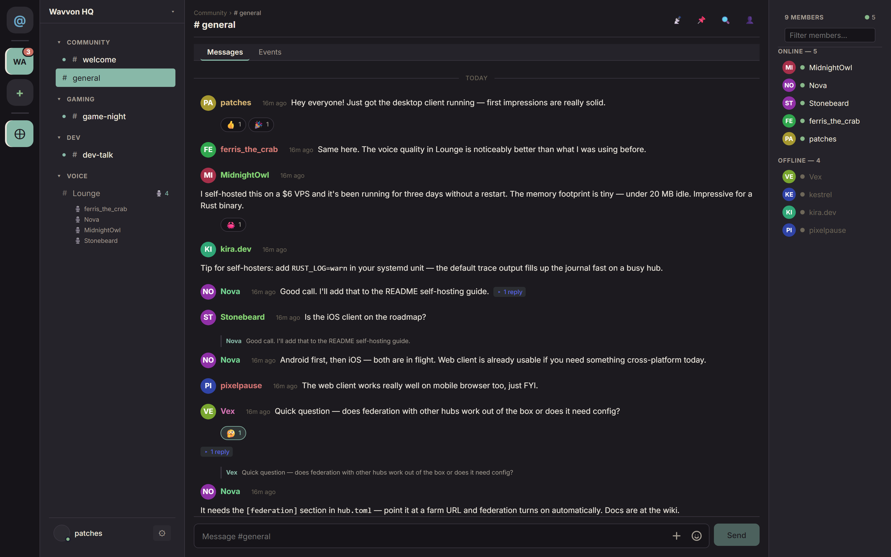

# Wavvon

**Built for players. Owned by no one.**

A decentralized platform where players can hang out, talk, and play
together. Voice chat, text messaging, federated alliances of hubs, and
community-built games — all keypair-based identity, no central servers.

Communities run their own **hubs** (a single Rust + SQLite binary) that
federate with each other. Your identity is an Ed25519 keypair that
belongs to you — no accounts, no e-mail, no phone number, no company in
the middle. DMs are end-to-end encrypted; hubs only ever relay
ciphertext. Everything is open source under AGPL-3.0.

Looking for an open-source, self-hostable alternative to Discord or
TeamSpeak? See the [feature comparison](COMPARISON.md) for how Wavvon
stacks up — including its honest limitations.

## Get started

- **Use Wavvon** — download the
  [desktop app](https://github.com/Wavvon/Wavvon-client/releases)
  (Windows / macOS / Linux), or read
  [getting-started.md](docs/getting-started.md).
- **Host a community** — run your own hub in 2 minutes with Docker:
  see [Wavvon-server](https://github.com/Wavvon/Wavvon-server), then
  the [hub operator guide](docs/hub-operator-guide.md).
- **Build on it** — the whole protocol is plain HTTP + WebSocket,
  specified in [`openapi.yaml`](openapi.yaml) and
  [ws-protocol.md](docs/ws-protocol.md). Write a client or a bot in any
  language.

## Features

- **Channels** — unified text + voice in every room. Categories,
  drag-drop reorder, markdown, attachments, reactions, replies,
  mentions, edit/delete, pins, polls, events, forum channels, search.
- **Voice** — Opus over UDP with RNNoise denoise, voice activity
  detection, push-to-talk, per-participant volume, whisper, proximity
  voice; webcam video and multi-sharer screen share via WebRTC.
- **Direct messages** — end-to-end encrypted (1:1 and group), federated
  delivery across hubs with retry, attachments, typing indicators.
- **Alliances** — multi-hub groups sharing channels and messages via
  federation.
- **Identity** — Ed25519 keypair, 24-word BIP39 recovery phrase,
  QR multi-device pairing with signed subkey certificates — no
  accounts, no passwords.
- **Roles & moderation** — custom roles, ban / mute / timeout / kick,
  channel bans, approval queue, content reporting, federated ban lists.
- **Security lobby** — PoW-gated entry, bot challenge, onboarding
  questionnaire — sybil resistance without a central authority.
- **Bots & games** — self-service bot creation, slash commands,
  webhook delivery; a sandboxed game SDK for community-built games.

## Repositories

| Repo | Local path | Contents |
|---|---|---|
| [Wavvon](https://github.com/Wavvon/Wavvon) *(this repo)* | `docs/` | Architecture docs, ROADMAP, design decisions, API spec |
| [Wavvon-server](https://github.com/Wavvon/Wavvon-server) | `server/` | Hub server, farm tooling, seed server, identity crate |
| [Wavvon-client](https://github.com/Wavvon/Wavvon-client) | `clients/` | All clients (desktop / web / Android) + shared packages + voice crate |
| [Wavvon-discovery](https://github.com/Wavvon/Wavvon-discovery) | `discovery/` | Optional public hub directory |

## Documentation

- [`docs/README.md`](docs/README.md) — the wiki index: architecture,
  identity, federation, alliances, voice, data model, threat model,
  design decisions, glossary, and a find-by-feature map.
- [`ROADMAP.md`](ROADMAP.md) — what's next, known issues, undesigned
  wishlist, and explicit "won't do" decisions.
- [`COMPARISON.md`](COMPARISON.md) — feature-by-feature comparison with
  Discord, Slack, Matrix, TeamSpeak, and Mumble.
- [`openapi.yaml`](openapi.yaml) — full REST API spec (OpenAPI 3.0) for
  client implementors; the WebSocket side is in
  [docs/ws-protocol.md](docs/ws-protocol.md).

Suggested reading order for newcomers:
[architecture.md](docs/architecture.md) →
[identity.md](docs/identity.md) →
[federation.md](docs/federation.md) →
[threat-model.md](docs/threat-model.md).

## Contributing

Issues and PRs are welcome in every repo — see
[CONTRIBUTING.md](CONTRIBUTING.md) for the branching model and release
process, and [docs/decisions.md](docs/decisions.md) for design
rationale before proposing big changes.

## License

[GNU Affero General Public License v3.0](LICENSE). Network use of a
modified version requires offering the corresponding source to users —
deliberately chosen for a federated platform.

## Built with AI assistance

This project was built with substantial help from
[Claude](https://claude.ai) (Anthropic's AI assistant). The product
owner directs architecture, features, and tradeoffs; Claude drafts
most of the code, tests, and documentation, which is then reviewed,
adjusted, and accepted.

Calling this out for transparency — it's not a fully hand-written
codebase, and pretending otherwise wouldn't be honest.
